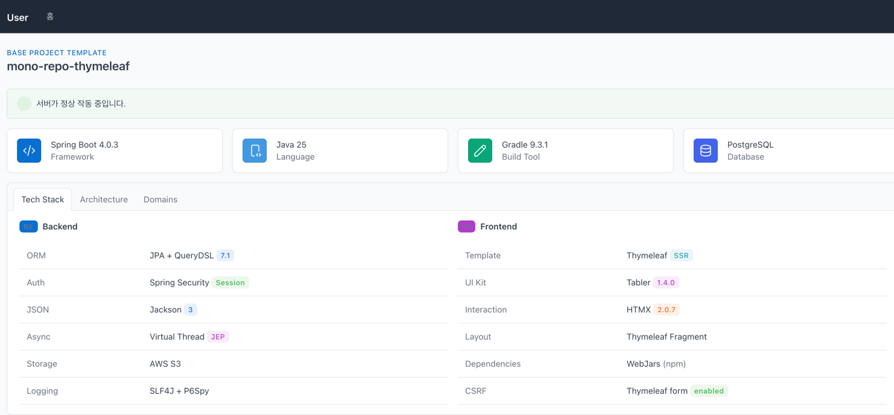
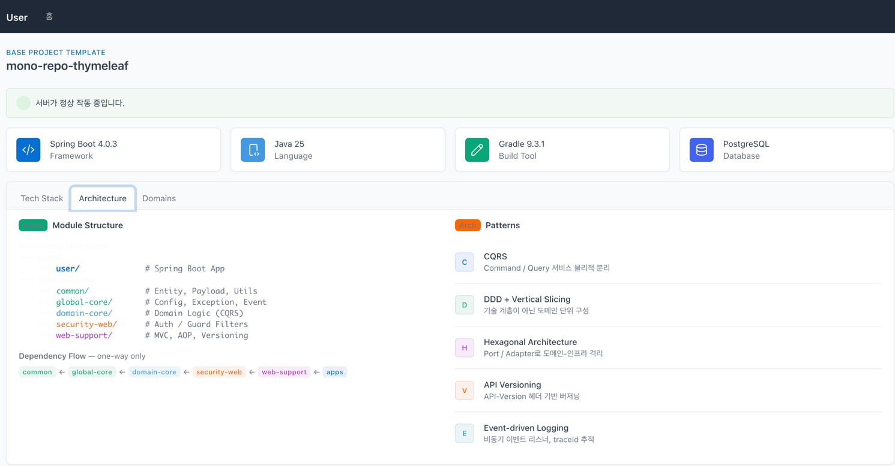
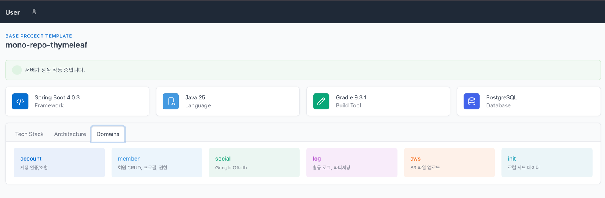

# mono-repo-thymeleaf

Spring Boot + Thymeleaf 기반의 **모노레포 베이스 프로젝트**입니다.
새 프로젝트를 시작할 때 이 템플릿을 복제하여 바로 개발에 착수할 수 있도록 설계되었습니다.





---

## 기술 스택

### 백엔드

| 영역           | 기술                            | 버전    |
|--------------|-------------------------------|-------|
| Language     | Java                          | 25    |
| Framework    | Spring Boot                   | 4.0.3 |
| Build        | Gradle (Kotlin DSL)           | 9.3.1 |
| ORM          | JPA + QueryDSL                | 7.1   |
| DB           | PostgreSQL                    | —     |
| Auth         | Spring Security (HttpSession) | —     |
| JSON         | Jackson 3                     | —     |
| Async        | Virtual Thread                | —     |
| File Storage | AWS S3                        | —     |
| Logging      | SLF4J + P6Spy                 | —     |

### 프론트엔드

| 영역              | 기술                      | 버전             |
|-----------------|-------------------------|----------------|
| Template Engine | Thymeleaf (SSR)         | Spring Boot 내장 |
| Layout          | Thymeleaf Fragment (순수) | —              |
| UI Kit          | Tabler (Bootstrap 5)    | 1.4.0          |
| Interaction     | HTMX                    | 2.0.7          |
| Dependency      | WebJars (npm)           | —              |

---

## 프로젝트 구조

```
mono-repo-thymeleaf/
├── apps/
│   └── user/                    # Spring Boot 앱 (Thymeleaf + REST API)
├── libs/
│   └── backend/
│       ├── common/              # 순수 공유 (entity, payload, utils, annotation)
│       ├── global-core/         # 인프라 공통 (config, exception, event, logging)
│       ├── domain-core/         # 도메인 로직 (account, member, social, log)
│       ├── security-web/        # 인증/인가 웹 필터
│       └── web-support/         # MVC, AOP, 예외 처리, API 버저닝
├── docs/
│   ├── backend/                 # 백엔드 개발 가이드 + 규칙
│   └── frontend/                # 프론트엔드 UI/UX 지침
├── build.gradle.kts
└── settings.gradle.kts
```

### 모듈 의존 방향

```
common ← global-core ← domain-core ← security-web ← web-support ← apps
```

> 역방향·순환 의존 금지. 모듈 간 통신은 하위 모듈의 인터페이스(Port)를 상위 모듈이 구현하는 방식으로 해결합니다.

---

## 시작하기

### 사전 요구사항

- **Java 25** (Gradle Toolchain이 자동 관리)
- **PostgreSQL** (로컬 또는 Docker)

### 실행

```bash
# 앱 실행 (로컬 8081, 프로덕션 8080)
./gradlew :apps:user:bootRun

# 빌드
./gradlew :apps:user:build
```

### 테스트

```bash
# 전체 테스트
./gradlew test

# 개별 모듈 테스트
./gradlew :libs:backend:common:test
./gradlew :libs:backend:global-core:test
./gradlew :libs:backend:domain-core:test
./gradlew :libs:backend:security-web:test
./gradlew :libs:backend:web-support:test
```

---

## 주요 특징

### 아키텍처

- **CQRS** — Command(상태 변경)와 Query(조회) 서비스를 물리적으로 분리
- **DDD + Vertical Slicing** — 기술 계층이 아닌 도메인 단위로 구성
- **Hexagonal Architecture** — Port/Adapter로 도메인을 인프라에서 격리

### 인증/보안

- **세션 기반 인증** — HttpSession + 쿠키 (Thymeleaf SSR 환경에 적합)
- **CSRF 보호** — Thymeleaf 폼 활성화, API 경로(`/api/**`) 제외
- **소셜 로그인** — Google OAuth 지원

### API 버저닝

- `/api/**` 요청은 `API-Version` 헤더 필수
- 예외: `/api/health`, `/api/social/**`

### 비동기 처리

- Virtual Thread 기반 Executor
- MDC(traceId) + SecurityContext 비동기 전파

### 로깅

- traceId 기반 요청 추적
- 이벤트 기반 비동기 로깅 (비즈니스 로직과 분리)
- 민감정보 자동 마스킹

### 프론트엔드

- **Tabler** UI 키트로 일관된 디자인
- **HTMX**로 JS 없이 서버 인터랙션
- WebJars로 정적 라이브러리 관리 (CDN 미사용)

---

## 도메인

| 도메인     | 역할                              |
|---------|---------------------------------|
| account | 계정 인증/조합 (member에 위임)           |
| member  | 회원 관리 (CRUD, 프로필, 권한)           |
| social  | 소셜 로그인 (Google OAuth)           |
| log     | 활동 로그 (이벤트 리스너, 파티셔닝)           |
| aws     | S3 파일 업로드                       |
| init    | 로컬 시드 데이터 (`@Profile("local")`) |

---

## 브랜치 전략

```
feat/*  ──→  develop  ──→  deploy/*
          (Squash PR)    (push 시 자동 배포)
```

- 모든 변경은 **feature 브랜치 → PR → CI 통과 → Squash Merge**
- develop, main 브랜치에 직접 push 금지

---

## 문서

| 문서                                                                               | 내용                         |
|----------------------------------------------------------------------------------|----------------------------|
| [`docs/backend/README.md`](docs/backend/README.md)                               | 백엔드 구조, 실행, 운영 가이드         |
| [`docs/backend/RULES.md`](docs/backend/RULES.md)                                 | 백엔드 개발 규칙 (아키텍처, 컨벤션, 보안)  |
| [`docs/frontend/UI_UX_RULES.md`](docs/frontend/UI_UX_RULES.md)                   | 프론트엔드 UI/UX 디자인 지침 (허브)    |
| [`docs/frontend/DESIGN_TOKENS.md`](docs/frontend/DESIGN_TOKENS.md)               | 색상, 타이포, 간격, 라운드, 애니메이션    |
| [`docs/frontend/COMPONENTS.md`](docs/frontend/COMPONENTS.md)                     | 컴포넌트 스타일, 레이아웃, 아이콘        |
| [`docs/frontend/PAGE_PATTERNS.md`](docs/frontend/PAGE_PATTERNS.md)               | 공통 페이지 패턴 (로그인, 목록, 폼 등)   |
| [`docs/frontend/TEMPLATE_CONVENTIONS.md`](docs/frontend/TEMPLATE_CONVENTIONS.md) | 기술 스택, 파일 구조, Thymeleaf 규칙 |
| [`docs/CI_STRATEGY.md`](docs/CI_STRATEGY.md)                                     | CI/CD 및 브랜치 전략             |
